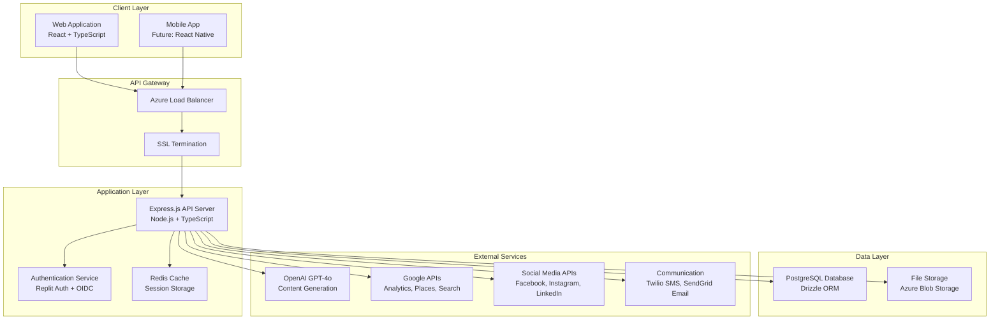
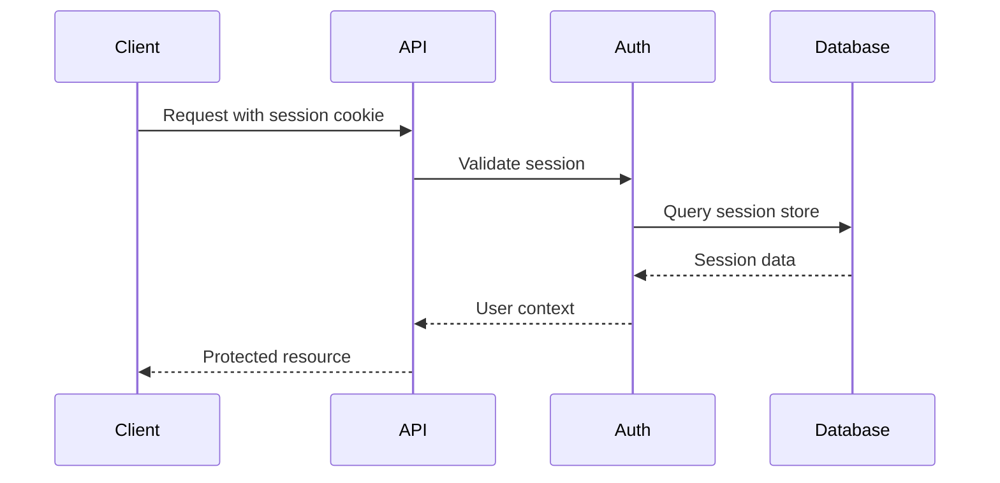
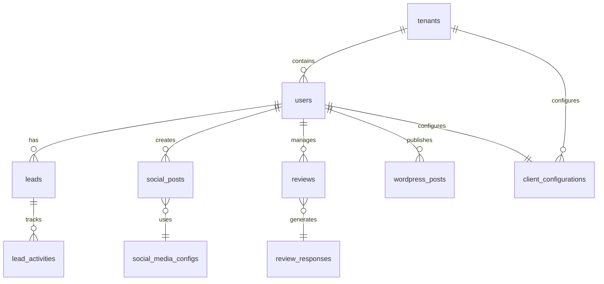
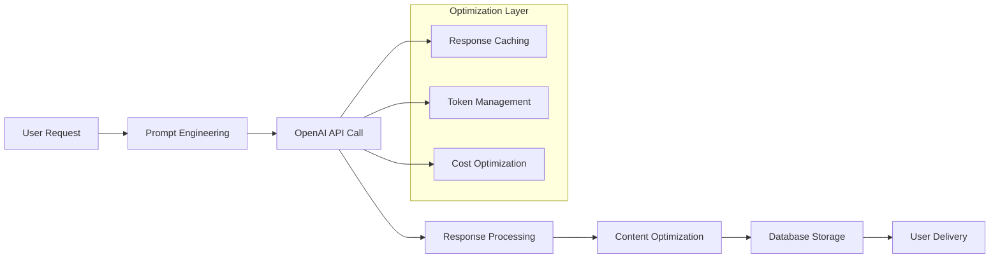
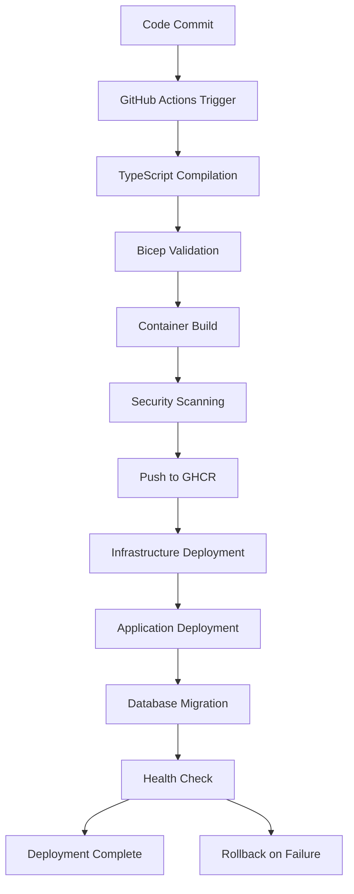

# FieldFlux Architecture Overview

## System Architecture

FieldFlux is a modern, cloud-native field service marketing platform built with a microservices-inspired architecture using containerized deployment on Azure. The system follows a multi-tenant SaaS model designed specifically for field service businesses.



## Technology Stack

### Frontend
- **Framework**: React 18 with TypeScript
- **Routing**: Wouter (lightweight router)
- **State Management**: TanStack Query + React hooks
- **Styling**: Tailwind CSS + shadcn/ui components
- **Build Tool**: Vite for fast development and optimized builds

### Backend
- **Runtime**: Node.js 18+ with TypeScript
- **Framework**: Express.js with comprehensive middleware
- **ORM**: Drizzle ORM for type-safe database operations
- **Authentication**: Replit Auth + OpenID Connect (OIDC)
- **Session Storage**: PostgreSQL-based sessions with Redis caching

### Database
- **Primary Database**: PostgreSQL 15 (Azure Flexible Server)
- **Schema Management**: Drizzle ORM with migrations
- **Caching**: Redis for session and application data
- **Backup**: Automated daily backups with point-in-time recovery

### Infrastructure
- **Cloud Provider**: Microsoft Azure
- **Container Platform**: Azure Container Apps (serverless containers)
- **CI/CD**: GitHub Actions with automated deployment
- **Monitoring**: Application Insights + Log Analytics
- **Security**: Azure Key Vault for secrets management

## Multi-Tenant Architecture

### Tenant Isolation Strategy

FieldFlux implements a **single-database, multi-tenant** architecture with row-level security and tenant-aware application logic.

```sql
-- Row-level security example
CREATE POLICY tenant_isolation ON leads 
FOR ALL TO application_user 
USING (user_id = current_setting('app.user_id'));

-- Tenant context in every query
SELECT * FROM leads WHERE user_id = $1;
```

### Benefits
- **Cost Efficiency**: Shared infrastructure with isolated data
- **Scalability**: Efficient resource utilization
- **Maintenance**: Single codebase for all tenants
- **Security**: Complete data isolation between tenants

### White-Label Support
- Custom domain support for enterprise clients
- Tenant-specific branding and configuration
- Isolated user namespaces and permissions
- Separate billing and subscription management

## API Architecture

### RESTful API Design

```
/api/
├── /auth                 # Authentication and session management
├── /users               # User profile and account management
├── /leads               # Lead management and CRM operations
├── /social              # Social media management
├── /reviews             # Review monitoring and responses
├── /analytics           # Performance metrics and reporting
├── /content             # Content generation and management
├── /communications      # Email and SMS campaigns
├── /settings           # Configuration and preferences
├── /integrations       # Third-party service connections
└── /webhooks           # External service callbacks
```

### Authentication Flow



### Request/Response Pattern

```typescript
// Standardized API response format
interface ApiResponse<T> {
  success: boolean;
  data?: T;
  error?: string;
  metadata?: {
    total?: number;
    page?: number;
    limit?: number;
  };
}

// Error handling middleware
app.use((err, req, res, next) => {
  const response: ApiResponse<null> = {
    success: false,
    error: err.message || 'Internal server error'
  };
  res.status(err.status || 500).json(response);
});
```

## Database Schema Design

### Core Entities



### Key Tables

#### User Management
```sql
users (
  id VARCHAR PRIMARY KEY,           -- Replit user ID
  email VARCHAR UNIQUE,
  subscription_status TEXT,         -- free, active, past_due
  tenant_id INTEGER REFERENCES tenants(id)
);
```

#### Lead Management
```sql
leads (
  id SERIAL PRIMARY KEY,
  user_id VARCHAR REFERENCES users(id),
  score INTEGER,                    -- AI-generated score (1-100)
  status TEXT,                      -- new, contacted, qualified, won, lost
  service_type TEXT,                -- hvac, plumbing, electrical
  urgency TEXT                      -- emergency, urgent, routine
);
```

#### Content Management
```sql
social_posts (
  id SERIAL PRIMARY KEY,
  user_id VARCHAR REFERENCES users(id),
  platform TEXT,                   -- facebook, instagram, linkedin
  content TEXT,
  scheduled_at TIMESTAMP,
  engagement_metrics JSONB
);
```

## Security Architecture

### Authentication & Authorization

```typescript
// Multi-layer security approach
const securityMiddleware = [
  helmet(),                    // Security headers
  rateLimit(),                // Rate limiting
  cors(corsOptions),          // CORS configuration
  csrf(),                     // CSRF protection
  requireAuth,                // Authentication check
  requireTenant,              // Tenant isolation
  hasPermission('read:leads') // Role-based access
];
```

### Data Protection
- **Encryption at Rest**: All sensitive data encrypted in PostgreSQL
- **Encryption in Transit**: TLS 1.3 for all API communications
- **Secrets Management**: Azure Key Vault for API keys and secrets
- **Session Security**: Secure cookies with HttpOnly and SameSite
- **Input Validation**: Comprehensive request validation with Zod

### Compliance Features
- **Audit Logging**: Complete audit trail for all data modifications
- **Data Retention**: Automated data archival and cleanup policies
- **GDPR Compliance**: Data export and deletion capabilities
- **SOC 2 Readiness**: Security controls and monitoring

## AI Integration Architecture

### Content Generation Pipeline



### AI Services Integration
- **Content Generation**: OpenAI GPT-4o for blog posts, social media, emails
- **Lead Scoring**: ML algorithms for lead qualification and prioritization
- **Sentiment Analysis**: Review sentiment scoring and response automation
- **SEO Optimization**: AI-powered keyword research and content optimization

### Cost Optimization Strategies
- **Response Caching**: Cache similar requests to reduce API calls
- **Prompt Engineering**: Optimized prompts for better token efficiency
- **Batch Processing**: Group similar requests for bulk processing
- **Smart Retry Logic**: Exponential backoff with circuit breakers

## Performance Architecture

### Caching Strategy

```typescript
// Multi-layer caching approach
const cacheStrategy = {
  // Level 1: Application-level caching
  memory: new Map(),
  
  // Level 2: Redis distributed cache
  redis: new Redis(process.env.REDIS_URL),
  
  // Level 3: Database query optimization
  database: {
    connectionPool: { max: 20, min: 4 },
    queryOptimization: true,
    indexStrategy: 'comprehensive'
  }
};
```

### Optimization Techniques
- **Connection Pooling**: Efficient database connection management
- **Query Optimization**: Indexed queries with Drizzle ORM
- **Response Compression**: Gzip compression for all API responses
- **CDN Integration**: Static asset delivery through Azure CDN
- **Lazy Loading**: On-demand resource loading in frontend

### Scalability Design
- **Horizontal Scaling**: Azure Container Apps auto-scaling
- **Database Scaling**: Read replicas for analytics workloads
- **Microservices Ready**: Modular architecture for service separation
- **Caching Layers**: Multiple caching strategies for performance

## Deployment Architecture

### Azure Container Apps Configuration

```yaml
# Container Apps scaling configuration
scale:
  minReplicas: 1
  maxReplicas: 10
  rules:
    - name: "http-scaling"
      http:
        metadata:
          concurrentRequests: "50"
    - name: "cpu-scaling"  
      custom:
        type: "cpu"
        metadata:
          type: "Utilization"
          value: "70"
```

### CI/CD Pipeline



### Environment Strategy
- **Development**: Cost-optimized with auto-shutdown
- **Staging**: Production-like environment for testing
- **Production**: High-availability with disaster recovery

## Integration Architecture

### External Service Integrations

```typescript
// Service integration pattern
class IntegrationManager {
  private integrations = new Map<string, ServiceIntegration>();
  
  constructor() {
    this.integrations.set('openai', new OpenAIIntegration());
    this.integrations.set('google', new GoogleServicesIntegration());
    this.integrations.set('facebook', new FacebookIntegration());
    this.integrations.set('twilio', new TwilioIntegration());
  }
  
  async callService(service: string, operation: string, data: any) {
    const integration = this.integrations.get(service);
    return await integration?.execute(operation, data);
  }
}
```

### Integration Patterns
- **Circuit Breaker**: Prevent cascading failures
- **Retry Logic**: Exponential backoff for failed requests
- **Rate Limiting**: Respect API quotas and limits
- **Fallback Strategies**: Graceful degradation when services unavailable
- **Webhook Support**: Real-time integration updates

## Monitoring and Observability

### Monitoring Stack
- **Application Insights**: Performance metrics and error tracking
- **Log Analytics**: Centralized logging and query capabilities
- **Azure Monitor**: Infrastructure monitoring and alerting
- **Custom Dashboards**: Business metrics and KPI tracking

### Key Metrics
- **Performance**: API response times, database query performance
- **Reliability**: Uptime, error rates, availability metrics
- **Business**: User engagement, feature adoption, revenue metrics
- **Security**: Authentication attempts, access patterns, security events

### Alerting Strategy
```typescript
// Critical alerts configuration
const alerts = {
  healthCheck: {
    threshold: '< 1 successful request in 5 minutes',
    severity: 'Critical',
    action: 'Page on-call team'
  },
  errorRate: {
    threshold: '> 5% error rate over 10 minutes',
    severity: 'Warning',
    action: 'Slack notification'
  },
  performance: {
    threshold: '> 500ms average response time',
    severity: 'Info', 
    action: 'Performance team notification'
  }
};
```

## Future Architecture Considerations

### Microservices Migration Path
As the platform grows, potential service separation:
- **User Service**: Authentication and user management
- **CRM Service**: Lead and customer management
- **Content Service**: AI-powered content generation
- **Analytics Service**: Reporting and business intelligence
- **Integration Service**: Third-party API management

### Advanced Features Roadmap
- **Event-Driven Architecture**: Implement event streaming with Azure Service Bus
- **GraphQL API**: Advanced query capabilities for mobile and third-party clients
- **Real-time Features**: WebSocket support for live updates and notifications
- **Machine Learning**: Custom ML models for industry-specific optimization

### Scalability Targets
- **Concurrent Users**: 10,000+ simultaneous users
- **Database Operations**: 10,000+ transactions per second
- **API Throughput**: 50,000+ requests per minute
- **Data Storage**: Multi-TB data handling with efficient querying
- **Global Distribution**: Multi-region deployment for international expansion